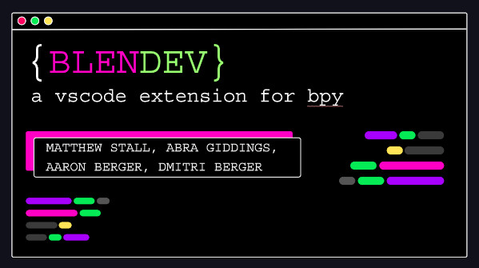

# blendev

## Features

VS Code's IntelliSense features do not work for Python API's  
blendev provides similar features for bpy, blender's Python API  
Get code suggestions, autocompletions, hover context, and a compact reference document, all beautifully integrated into your VS Code client!
 

----
 

blendev requires a downloaded file of blender's documentation for bpy in `.JSON` format. 

Place that file in your resources folder to begin using blendev! 

[View Presentation To Learn More](https://docs.google.com/presentation/d/1D-cZ9JtKrAxT6Y1mAZg_6xmszvchKv_36T9kg99GGqc/edit?usp=sharing)

**Enjoy!**
